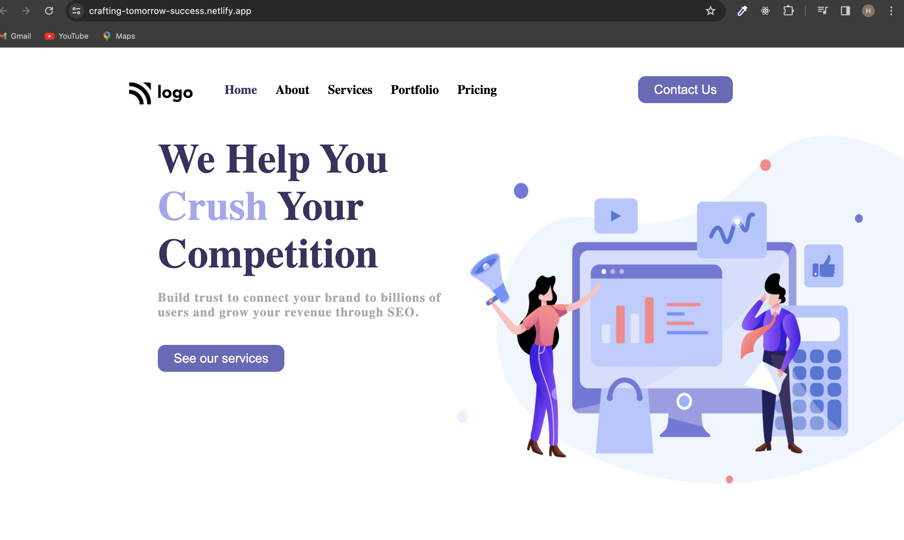

### Crafting Tomorrow's Success: Digital Marketing Home Page

This project developed with pure HTML and CSS mainly focused on positions

[ Digital Marketing Home Page](https://crafting-tomorrow-success.netlify.app/)

 

 

Welcome to our Digital Marketing Home Page, a dynamic online space designed to empower businesses and individuals with cutting-edge digital marketing strategies. This project is hosted on Netlify, offering a glimpse into the future of successful online ventures.

### Technologies Used

 

HTML and CSS:
The backbone of our project, HTML and CSS work together to create a visually appealing and structured interface.

Netlify Hosting:
Leveraging the power of Netlify for seamless deployment, hosting, and continuous integration.

### Demo :

### You can Check it Live on Below Link :

[Live Link !](https://crafting-tomorrow-success.netlify.app/)